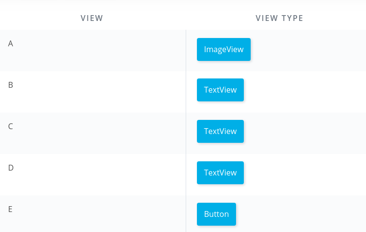
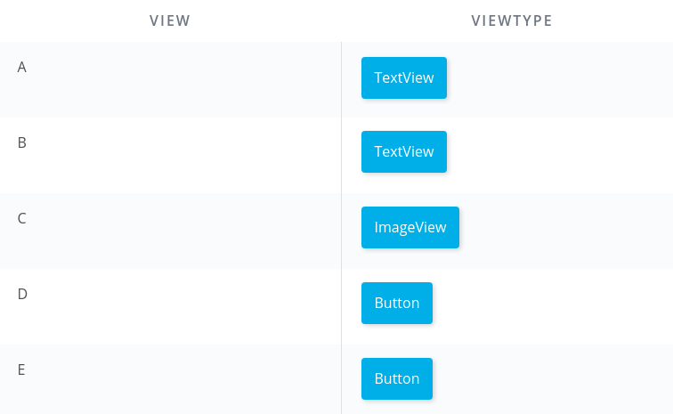
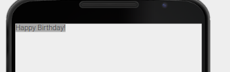

# Android Basics: User Interface

Learn the basics of `Android` and `Java` programming, and take the first step on your journey to becoming an Android developer!

This course is designed for students who are `new` to programming, and want to learn how to build Android apps. You don’t need any programming experience to take this course. If you’ve been using a smartphone to surf the web and chat with friends, then you’re our perfect target student!

Learning anything new can be tough. We will walk you through the process of making Android apps, but to get the most out of this course, you must bring your `enthusiasm` for learning, and budget time on your calendar to learn with us.

By the end of this course, you will have learned how to build an `app’s layout` and then practiced those skills by making a `Birthday Card App`.

- [Android Basics: User Interface](#android-basics-user-interface)
  - [Building Layouts: Part 1](#building-layouts-part-1)
    - [Introduction](#introduction)
    - [Preparing for the Journey Ahead](#preparing-for-the-journey-ahead)
    - [Quiz: Views](#quiz-views)
    - [Quiz: Picking Views for YouTube App](#quiz-picking-views-for-youtube-app)
    - [Talking to Your Phone](#talking-to-your-phone)
    - [Quiz: Using a TextView](#quiz-using-a-textview)
    - [XML Syntax](#xml-syntax)
    - [Quiz: Change the TextView](#quiz-change-the-textview)
    - [Quiz: Getting Past Errors](#quiz-getting-past-errors)
    - [Quiz: Setting `wrap_content`](#quiz-setting-wrap_content)
    - [Quiz: TextView `textSize`](#quiz-textview-textsize)

## Building Layouts: Part 1

Learn how to place `layouts` on a page to `create` `images`, `buttons`, and `text` on a `phone` screen.

### Introduction

Congratulations on taking the first step to learning Android! By the end of this course, you’ll know how to make a single-screen Android app with text and images. We’ll discuss how to create a `user interface` through a series of short videos with lots of hands-on practice.


In the practice set, we’ll walk through step-by-step how to create an app, like this birthday card, and show you how to run it on an Android device.


Then you’ll have a chance to customize the card for a loved one for any special occasion coming up. When you look at your phone, how many apps were created specifically for you in mind? Creating a mobile app is a highly creative process, where adding a personal touch can truly make an app shine. To see heartwarming and funny cards created by students, check out the [discussion forum][2].

In this course, you’ll learn how to use Android Studio, the tool that professional developers use to create apps. Be sure that your computer meets the [system requirements][1] for Android Studio. The course will take about 3 - 5 hours of dedicated work, but it can widely vary per student, so take your time to learn the concepts.

### Preparing for the Journey Ahead

**Common obstacles**:

When speaking with many students, we found common reasons why they were hesitant to start learning Android:

- Lack of confidence that they can be a developer
- Code seems intimidating
- Tools seem complex
- Too much jargon
- Concepts are too abstract

We take these obstacles seriously and came up with ways to try to help you overcome them. Our aim is to make the learning curve as comfortable as possible for you as a student, so your confidence grows with each new concept mastered.

**Visuals**:

For all the visual learners out there, we use lots of drawings, analogies, and props to explain technical concepts that otherwise could be confusing.


**Vocab Glossary**:

We also don’t want you to be overwhelmed by all the jargon that comes up, or to feel like you need to memorize it. As a result, we’ve created a custom [vocabulary glossary][3] to help you. If you ever forget what a word means, you can check out the glossary for a beautiful image, description, and code sample.


**Instructor Notes**:

When navigating in the Udacity classroom, if you scroll vertically below a video, you’ll often find instructor notes. In these notes, we’ve provided supplementary links to other resources that you can read to get more information about the concepts covered in the video.

**Learning Something New**:

If you’re motivated and willing to be persistent, we are fully confident in your ability to learn Android development. We have thousands of students who have gone from no coding experience to building simple apps on their own. You can do this!

**Video Link**:

[](https://www.youtube.com/watch?v=DWl0Racf4Gg)

### Quiz: Views

The first thing in Android you need to learn is something called **Views**.

`Views`: A view is a rectangle on the screen that shows some content. It can be and image, a piece of text or a button or anything else that the app can display. Now the individual views make up what we call the layout of the screen.

**Video Link**:

[](https://www.youtube.com/watch?v=ctvsMCVlENI)

Camel case is a convention that is not limited to programming. If you've ever used FedEx, listened to an iPod, created a PowerPoint, or eaten at McDonalds, you've encountered camel case!

We used a lot of new words in this video!

- Layout
- User Interface
- TextView
- ImageView
- Button
- Camel case

Don't worry, you don't have to memorize them. You can look up their definitions by clicking here and searching for them. Believe it or not, professional developers don't memorize everything -- looking up information is a key part of the job! You can look up their definitions in the Vocab Glossary.

**Quiz: Views**:


**Answer**:



### Quiz: Picking Views for YouTube App




### Talking to Your Phone

**Video Link**:

[](https://www.youtube.com/watch?v=gONbjxZM-0s)

Here are the words we introduced in this video:

- `Code`
- `XML`
- Integrated development environment (`IDE`) - This is the tool in which we will write our code. Similar to how we can use GMail as the tool to write an email, to write code for Android, we will use an IDE an IDE called Android Studio.

You can look up their definitions in the [Vocab Glossary][3].

### Quiz: Using a TextView

**Video Link**:

[](https://www.youtube.com/watch?v=sNqq_1Yg_i0)

### XML Syntax

**Video Link**:

[](https://www.youtube.com/watch?v=s2VszKiPD0E)

Here are the words we introduced in this video:

- XML element
- Tag
- Self-closing tags
- Attributes
- Syntax

[Android Visualizer: Write Code And See The Effect On The Online][4]

```xml
<TextView
    android:text="Happy Birthday!"
    android:background="@android:color/darker_gray"
    android:layout_width="150dp"
    android:layout_height="75dp" />
```

[Under Standing Layout][5]

You can look up their definitions in the Vocab Glossary.

Believe it or not, professional developers don't memorize everything -- looking up information is a key part of the job!

### Quiz: Change the TextView

**Video Link**:

[](https://www.youtube.com/watch?v=uuB1HApT9nk)

Words we used in this video:

- Android Studio
- Device
- Density-Independent Pixels

What does Density-Independent Pixel actually mean? You might be familiar with a pixel, which is a small illuminated area on a screen. Screens are essentially made up of hundreds of thousands of these pixels.

So what is a "density independent" pixel? Well, better screens will often have more pixels in the same amount of space. The number of pixels in a fixed space is known as the screen's pixel density. In case you're wondering, 48dp translates to approximately 9mm in physical size. See more info [here][5]

### Quiz: Getting Past Errors

**Video Link**:

[](https://www.youtube.com/watch?v=chwcMqcoSS0)

Debugging steps:

1. Read the error message
1. Compare to working code
1. Undo
1. Ask for help

[Link to the XML Visualizer][4]

[Link to the Common Views Cheatsheet][6]

[Link to code sample][7]

[How to take a screenshot][8]

**Quiz: Getting Past Errors**:


1. TextView should not have an open space
1. There should be a closing tag for TextView
1. 150dp instead of 150
1. "gray" instead of "groy"

### Quiz: Setting `wrap_content`

[](https://www.youtube.com/watch?v=6_BGuYSLDcI)

Words we used in this video:

- Hard coding
- `wrap_content`

```xml
<TextView
    android:text="Happy Birthday!"
    android:background="@android:color/darker_gray"
    android:layout_width="wrap_content"
    android:layout_height="wrap_content" />
```



### Quiz: TextView `textSize`


[The Type System][9]

```xml
<TextView
    android:text="Happy Birthday!"
    android:background="@android:color/darker_gray"
    android:layout_width="wrap_content"
    android:layout_height="wrap_content"
    android:textSize="45sp" />
```

<!-- urls/paths -->
[1]: https://developer.android.com/studio/index.html#Requirements
[2]: https://discussions.udacity.com/t/make-your-own-card/19643
[3]: https://developers.google.com/android/for-all/vocab-words/?hl=en
[4]: https://labs.udacity.com/android-visualizer/#/android/text-view
[5]: https://material.io/design/layout/understanding-layout.html
[6]: https://drive.google.com/file/d/0B5XIkMkayHgRMVljUVIyZzNmQUU/view?usp=sharing
[7]: https://gist.github.com/anonymous/8bb1c5d7e4d3e434fb10
[8]: https://developer.android.com/studio/debug/am-screenshot.html
[9]: https://material.io/design/typography/the-type-system.html#type-scale
