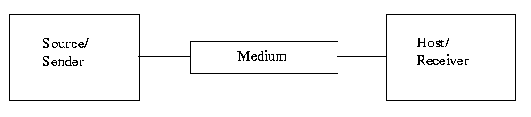

# Education4U(Communication Engineering)

## Table Of Contents

- [Education4U(Communication Engineering)](#education4ucommunication-engineering)
  - [Table Of Contents](#table-of-contents)
    - [Data Communication and It's Components](#data-communication-and-its-components)

### Data Communication and It's Components

**Definition**: Electronic transmission of information or data that exchange between two devices via some form of transmission medium such as wire cable or wireless also.

A **data communication** system is made upon five basic components.

1. Message
2. Sender(Person or System)
3. Receiver(Person or System)
4. Medium(Wire or Wireless)
5. Protocol(Set of Rules)

**Note**: Without some set of rules or `protocol` we can not `send` data in our destination safely.

**Diagram** of all basic components

**Medium(or simply `Physical Path`)** in Data Communication
