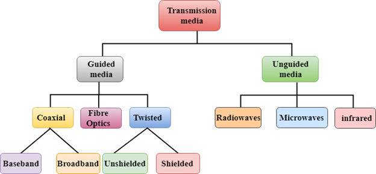
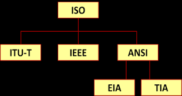

# Education4U(Communication Engineering)

## Table Of Contents

- [Education4U(Communication Engineering)](#education4ucommunication-engineering)
  - [Table Of Contents](#table-of-contents)
    - [Data Communication and It's Components](#data-communication-and-its-components)
    - [Protocols and Standard](#protocols-and-standard)

### Data Communication and It's Components

**Definition**: Electronic transmission of information or data that exchange between two devices via some form of transmission medium such as wire cable or wireless also.

A **data communication** system is made upon five basic components.

1. Message
2. Sender(Person or System)
3. Receiver(Person or System)
4. Medium(Wire or Wireless)
5. Protocol(Set of Rules)

**Note**: Without some set of rules or `protocol` we can not `send` data in our destination safely.

**Diagram** of all basic components

**Medium(or simply `Physical Path`)** in Data Communication

### Protocols and Standard

**Protocols**: A `protocols` is consist of set of **rules** that govern `Data Communication`. It determines,

- `What` is communicated,
- `How` it is communicated and
- `When` it is communicated.

**Key elements of protocols**:

- **Syntax**:
  - `Structure` or `format` of data.
  - Indicates how to read the `bits`.
- **Semantics**:
  - `Interprets` the meaning of the `bits`.
  - Knows which `fields` define what `action`
- **Timing**:
  - When data should be send and what data and how to be send.
  - Speed.

**Standards**: Provides the guidelines to manufactures, vendors, government agencies and others service providers that ensure the kind of inter-connectivity necessary in todays marketplace and in the international communications.

> Standards is nothing but `agreed upon rules`.

**Categories of Standards**:

1. **De facto**: By `convention` or by `fact`.
2. **De jure**: By `law` or by `government`.

Standards `ORGANIZATION` for Data Communications:

- `ISO`: International Standards Organization
- `ITU-T`: International Telecommunication Union Telecommunication Standardization Sector
- `IEEE`: The Institute of Electrical and Electronics Engineers
- `ANSI`: American National Standards Institute
- `EIA`: Electronics Industries Association
- `TIA`: Telecommunications Industries Association
